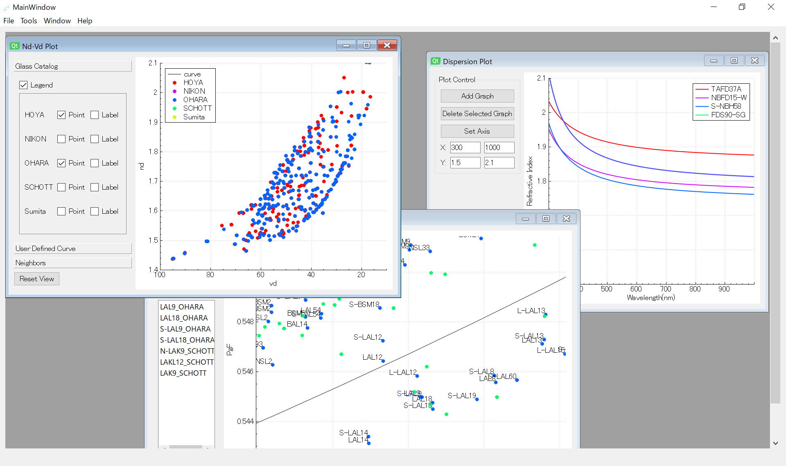

# GlassPlotter - Desktop Glassmap Viewer

## Overview
GlassPlotter is an open source and easy-to-use glass map viewer.  

As listed below, GlassPlotter features to provide a great variety of analytical tools and to support large number of optical glasses (or optical materials) from multiple manufacturers.

It is also noteworthy that GlassPlotter is developed as a standalone application with intuitive GUI, allowing diverse optical engineers to use easily and anywhere without any scripting or specific environment.

## Functionality
- Supported Format
  - [x] Zemax AGF
  - [x] CODEV XML
- Glassmaps
  - [x] nd - vd
  - [x] ne - ve
  - [x] PgF - vd
  - [x] PCt - vd
  - [ ] Buchdahl coefficients (test)
  - [ ] mechanical property
- Plots
  - [x] Refractive index vs wavelength plot
  - [x] Transmittance vs wavelength plot
  - [x] Thermal coefficient (dn/dt) plot
- Tables
  - [x] Various glass properties (optical, mechanical, chemical, etc)
- Utilities
  - [x] Glass search (used for glass fitting)

## Getting Started 
The prebuilt binaries can be downloaded from [Release page](https://github.com/heterophyllus/glassplotter/releases/latest).

See also [Wiki](https://github.com/heterophyllus/glassplotter/wiki) for further information.

## Glass Catalogs
This application obtains glass property data from AGF/XML files distributed elsewhere, most of which are freely available.

Note that the catalog files in this repository are not always up to date.

1. Zemax AGF  
   Available on each manufacturer's website. 

2. CODE V XML  
   Available on [Synopsys support page](https://www.synopsys.com/optical-solutions/support/support-glass-catalog.html).

## Dependency

|Library|Description|
|---|---|
|[Qt](https://www.qt.io)|GUI library|
|[QCustomPlot](https://www.qcustomplot.com)|Graph plotting library|
|[spline](https://github.com/ttk592/spline)|Cubic spline interpolation library|
|[Eigen](http://eigen.tuxfamily.org/index.php?title=Main_Page) | Template library for linear algebra|
|[pugixml](https://github.com/zeux/pugixml)|Simple XML parser|

All of the aboves except Qt itself have been already included in this repository.

## License
This project is licensed under GPL License - see the [LICENSE](LICENSE.md) for details.

## Contribution
Contributions and feedbacks are greatly appreciated.
Please read [CONTRIBUTING](CONTRIBUTING.md) for details on our code of conduct, and the process for submitting pull requests to us.
