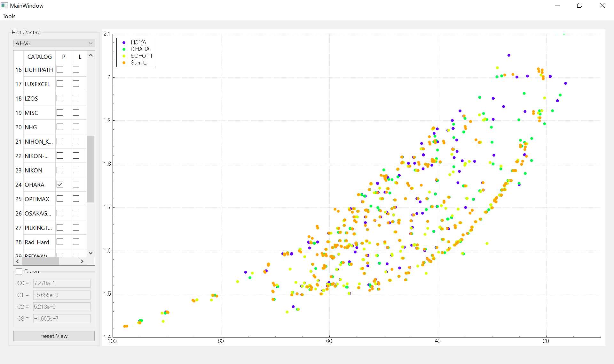

# GlassPlotter

## Overview
GlassPlotter is a open source, desktop glass map viewer.  This application aims to be a comprehensive glass explorer, which would be helpful for diverse optical engineers.

## Getting Started
Package for Windows can be downloaded [here](https://github.com/heterophyllus/glassplotter/releases/tag/v0.1.1).
  Just run GlassPlotter.exe.

## Resources
This application extracts glass data from Zemax AGF file.  Each AGF file can be downloaded from the supplyer's web site. If Zemax has been installed, they are contained in the folder like Documents/Zemax/Glasscat.

## Development
This application is built with;
- [Qt and QtCreator](https://www.qt.io)
- [QCustomPlot](https://www.qcustomplot.com)

This project is under development and still far from completion.  Following features are going to be implemented.

  + [ ] Glass Map
      - [x] nd-vd
      - [x] ne-ve
      - [x] vd-PgF
      - [x] User Defined Curve
  + [ ] Glass Dispersion Plot
  + [ ] Glass Catalog View
  

## License
This project is licensed under the GPL License - see the [LICENSE](LICENSE.md) for details.

## Contribution
Contributions and feedbacks are always welcome.

## Acknowledgement
This project is inspired by several preceding repositories.  I would like to express my respect for following remarkable ones.
- [mjhoptics/opticalglass](https://github.com/mjhoptics/opticalglass) :
  glass map viewer with simple GUI, written in python.
- [nzhagen/zemaxglass](https://github.com/nzhagen/zemaxglass) : python suite to utilize Zemax glass data.
