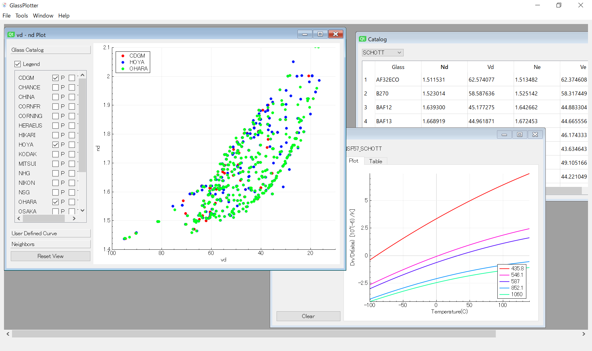

# GlassPlotter - Desktop Glassmap Viewer

## Overview
GlassPlotter is easy-to-use glass map viewer. It hopes to be useful for diverse optical engineers. 

## Features
- Support great variety of glassmaps and plots
- Support large number of optical glasses from multiple manufacturers
- Standalone application

## Getting Started 
The prebuilt binaries can be downloaded from [Release page](https://github.com/heterophyllus/glassplotter/releases/latest).

See also [Wiki](https://github.com/heterophyllus/glassplotter/wiki) for further information.

## Glass Catalogs
This application obtains glass property data from AGF/XML files distributed elsewhere, most of which are freely available.

Note that the catalog files in this repository are not always up to date.

1. Zemax AGF  
   Available on each manufacturer's website. 

2. CODE V XML  
   Available on [Synopsys support page](https://www.synopsys.com/optical-solutions/support/support-glass-catalog.html).

## Notes
This application computes refractive index relative to air(relative refractive index). This is because the values in the catalog are relative index values. And the refractive index of optical glasses changes with temperature, the extend of which depending on the glass type and on the wavelength. Read [Schott Technical Information (TIE-19)](https://www.schott.com/products/optical-glass/downloads) for calculation details.

When you find a slight difference between official data and that of this application,
check the environment temperature setting (File->Preference). With the temperature value set to the same as that of the glass manufacturer, the calculated refractive index should be the same value.

## Dependency

All of the followings except Qt itself have been already included in this repository.

|Library|Description|
|---|---|
|[Qt](https://www.qt.io)|GUI library|
|[QCustomPlot](https://www.qcustomplot.com)|Graph plotting library|
|[spline](https://github.com/ttk592/spline)|Cubic spline interpolation library|
|[Eigen](http://eigen.tuxfamily.org/index.php?title=Main_Page) | Template library for linear algebra|
|[pugixml](https://github.com/zeux/pugixml)|Simple XML parser|

## License
This project is licensed under GPL License - see the [LICENSE](LICENSE.md) for details.

## Contribution
Contributions and feedbacks are greatly appreciated.
Please read [CONTRIBUTING](CONTRIBUTING.md) for details on our code of conduct, and the process for submitting pull requests to us.
